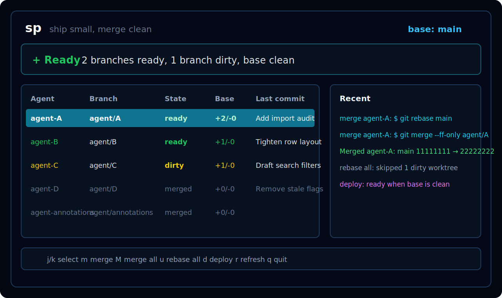

# sp

`sp` is a fast terminal cockpit for developers who run a lot of parallel work in git worktrees.

It watches agent branches, shows what is ready to merge, keeps dirty work obvious, and gives you a few high-leverage keys for the daily loop:

- `m` merge the selected worktree
- `M` merge every ready worktree
- `u` rebase all worktrees onto the base branch
- `d` run your deploy command
- `r` refresh
- `q` quit

It is intentionally small: no daemon, no database, no SaaS, no hidden state. It shells out to `git`, renders a compact Ratatui interface, and stays responsive by doing expensive status polling off the UI thread.



## Why

Most git tools are built around one branch at a time. My actual programming loop often looks like this:

1. Spawn a few focused agents in separate worktrees.
2. Let them work independently.
3. Watch which branches are ready, dirty, stale, or blocked.
4. Merge clean work in order.
5. Rebase everything against `main`.
6. Deploy when the base checkout is clean.

`sp` makes that loop visible at a glance. It is the sort of tool you build when you like programming enough to remove the tiny frictions around programming.

## Install

```bash
cargo install --path .
```

From GitHub:

```bash
cargo install --git https://github.com/barturba/sp
```

Or run from a checkout:

```bash
cargo run --release --bin sp
```

## Quick Start

From any git repository:

```bash
sp
```

For scriptable output:

```bash
sp --once
```

Point it at another checkout:

```bash
sp --repo ~/code/my-app --base main
```

## Configuration

`sp` auto-discovers worktrees with `git worktree list --porcelain`. Add `sp.toml` at the repo root when you want stable labels, explicit branch order, or deploy support:

```toml
base_branch = "main"
deploy_command = "bin/deploy"

[[worktree]]
label = "agent-A"
branch = "agent/A"
path = "../my-app-worktrees/agent-A"

[[worktree]]
label = "agent-B"
branch = "agent/B"
path = "../my-app-worktrees/agent-B"

[[worktree]]
label = "agent-annotations"
branch = "agent/annotations"
path = "../my-app-worktrees/agent-annotations"
```

## Safety Model

`sp` is deliberately conservative.

- Merge is blocked if the base checkout is not on the base branch.
- Merge is blocked if the base checkout is dirty.
- Merge is blocked if the selected worktree is dirty, missing, or on the wrong branch.
- Merge first rebases the target branch onto the base branch.
- Fast-forward merges are preferred.
- Non-fast-forward clean merges are committed with Git's merge message.
- Conflicted merges and rebases are aborted and reported.
- Rebase-all stashes dirty worktrees before rebasing, then restores the stash.

This is not magic. It is boring git automation with sharp edges rounded off.

## Demo Repo

Create a disposable demo repository with two agent worktrees:

```bash
scripts/demo-repo.sh /tmp/sp-demo
cd /tmp/sp-demo/repo
sp
```

## Development

```bash
cargo fmt --check
cargo test
cargo clippy -- -D warnings
```

The TUI is built with:

- Rust
- Ratatui
- Crossterm
- Clap

## Name

`sp` is short because tools you run all day should be short. Read it as "ship panel", "status panel", or just a tiny command that helps you keep moving.
